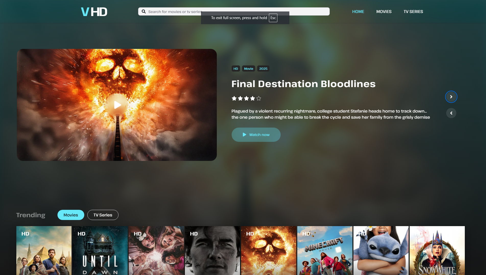

## ⚙️ Scripts

| Command         | Description              |
| --------------- | ------------------------ |
| `npm run dev`   | Start development server |
| `npm run build` | Build for production     |
| `npm run start` | Start production build   |
| `npm run lint`  | Run lint checks          |

---

## 🧑‍💻 About the Project

**VHD-TV** is designed as a modern streaming experience, showcasing interactive layouts, trailer playback, and seamless page transitions.  
It demonstrates clean UI design, component reusability, and optimized client-side rendering for real-world web applications.

---

## 🔗 Links

- **Live:** [https://vhd-tv.vercel.app](https://vhd-tv.vercel.app/)
- **GitHub:** [https://github.com/Jaymeen1712/Next-14-TMDB-Movie-Series-WebApp](https://github.com/Jaymeen1712/Next-14-TMDB-Movie-Series-WebApp)

---
